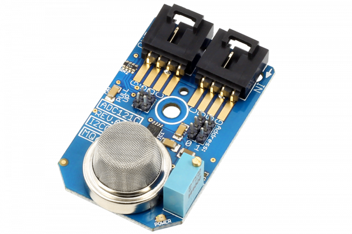

[](https://store.ncd.io/product/mq-6-lpg-iso-butane-lpg-propane-lng-natural-gas-sensor-adc121c-12-bit-adc-i2c-mini-module/).

# ADC121C_MQ6
The MQ-6 is capable of sensing Iso-Butane, LNG Natural Gas and LPG Propane air concentration levels between 200 and 10,000ppm. The ideal sensing condition for the MQ6 is 20°C ±2°C at 65% ±5% humidity. 
This Device is available from www.ncd.io 

[SKU: ADC121C_MQ6_I2CS]

(https://store.ncd.io/product/mq-6-lpg-iso-butane-lpg-propane-lng-natural-gas-sensor-adc121c-12-bit-adc-i2c-mini-module/)
This Sample code can be used with Raspberry Pi.

Hardware needed to interface ADC121C_MQ6 Sensor With Raspberry Pi : 

1. <a href="https://store.ncd.io/product/mq-6-lpg-iso-butane-lpg-propane-lng-natural-gas-sensor-adc121c-12-bit-adc-i2c-mini-module/">ADC121C_MQ6 LPG propane and LNG natural Gas Sensor</a>

2. <a href="https://store.ncd.io/product/i2c-shield-for-raspberry-pi-3-pi2-with-outward-facing-i2c-port-terminates-over-hdmi-port/">Raspberry Pi I2C Shield</a>

3. <a href="https://store.ncd.io/product/i%C2%B2c-cable/">I2C Cable</a>

## Python

Download and install smbus library on Raspberry pi. Steps to install smbus are provided at:

https://pypi.python.org/pypi/smbus-cffi/0.5.1
Download (or git pull) the code in pi. Run the program.

```cpp

$> python ADC121C_MQ6.py

```

The lib is a sample library, you will need to calibrate the sensor according to your application requirement.
